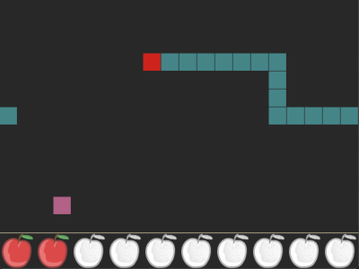

# About

Early stage of a game and a present to my little daughter that was created
while I was teaching myself Python. Because of the later, perhaps not yet very
"Pythonic..."




The additional packages `Pygame` (gaming framework) and `transitions` (state
machine implementation) are used.

# Dependencies

- Python >= 3.10
- Python packages
  - Pygame
  - transitions 

# Setup

## Virtual Python environment

After checkout better create a virtual Python environment if you haven't
already one. I usually use a generic environment that I have created once, as
the packages don't differ too much between my projects.

To Create an environment in your Windows user directory:
```
python -m venv %USERPROFILE%\.virtualenvs\generic-env
```

Activate the environment with:
```
%USERPROFILE%\.virtualenvs\generic-env\Scripts\activate.bat
```

## Install the requirements

First, verify that the virtual environment is active: If the environment is
active, you will see `(generic-env) ` before the usual prompt.

Then install the requirements with
```
pip install -r requirements.txt
```

# Run

## From Shell
The easiest way to run the game is to enter the `src` directory and type:

```
python main.py
```

## From VSCode

The most comfortable way for also developing it is to open the project
directory with visual Studio Code.

Only once, before starting the game from VSCode for the first time, you should
- python interpreter from the virtual environment created above
- select the supplied debug configuration `Snake` (in VSCode first press 
`<Ctrl + Shift + d>` and then select `Snake`)

Then press `F5` to run the game in debug mode.

## Run the Unit test from VSCode

There's currently one file that contains an unit test: `snake_entity_tests.py`.
To run/debug the tests in this file with vscode, select the debug configuration
`Python: Current file` in the same way as you did with `Snake` above. Then
press `F5` to run the test.

# Controls

Use the `arrow keys` to control the direction of the snake.

Use the keys `1..5` (but not the ones on th numeric keypad) to set the game
speed. Defaults to 2.

Press `ESC` to quit the game.
